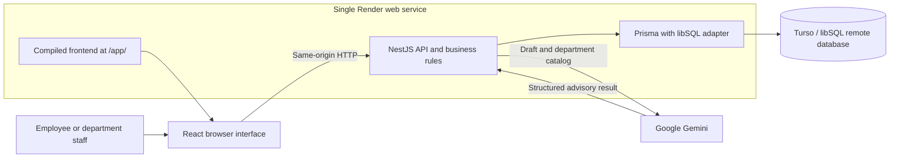

# Architecture

The Internal Operations Service Hub uses one React frontend and one NestJS backend in the same repository. Employees submit requests to IT, Human Resources or Finance; the receiving department accepts and completes the work. NestJS serves the Vite-built frontend at `/app/` and exposes the HTTP API on the same origin. The backend owns validation, authorization and lifecycle rules.

Locally, the same Prisma adapter uses a SQLite file instead of Turso. Development can run Vite separately, with API requests proxied to NestJS. The hosted application does not depend on the student's laptop.

## Request intake and AI boundary

The employee form sends its title, description, department and priority to `POST /ai/submit-request`. `AiController` validates the draft and known demo identity. In Gemini mode, the backend sends only the draft and trusted department catalog to Google. The API key stays on the server; employee records and request history are not included in the prompt.

Gemini returns suggested wording, department, priority, an explanation and concerns. The backend validates the structure, field limits and allowed product values. Concerns or a department mismatch return feedback without creating a request. A passing review creates a **Submitted** request using the employee's original wording and selections. Accepting corrections edits the draft; it does not approve the work.

Gemini has no database tools and cannot accept, start or complete a request. Provider failures leave the draft unsent. A temporary provider HTTP 503 is retried once with a bounded delay; there is no automatic switch to local checks or another provider. The configured Gemini model defaults to `gemini-3.1-flash-lite`.

Explicit local mode uses programmed completeness checks rather than AI. An optional OpenAI mode remains available. The legacy `POST /requests` route supports manual intake without AI, so AI review is not a universal authorization boundary. The [API contract](api-contract.md) defines endpoint shapes and errors; [Week 4](week4-production-ai.md) explains evaluation and provider limits.

## Workflow, persistence and retries

`AppService` checks ownership, department membership and legal transitions. Staff in the receiving department move a request through **Submitted → Accepted → In Progress → Completed**, or reject an active request with a reason. The API calls the Accepted state `Assigned`. Terminal requests cannot change state. Request creation and status changes write their history in database transactions, preserving the actor, time and note.

Prisma stores employees, departments, memberships, requests, the ticket counter and status history. Completion notifications use the request's completion and read timestamps; only its creator can read or acknowledge them. The frontend refreshes requests and notifications every 15 seconds while visible and when focus returns. There is no email or push-notification service.

The browser retains an `Idempotency-Key` for an unchanged draft in session storage. The backend stores a unique key and normalized payload hash with the request. A matching retry returns the original ticket without another AI review; a conflicting payload or employee returns 409. This protects retries after a database commit whose HTTP response was lost. Clients that omit the optional key do not receive this guarantee.

## Hosting and operations

The app is deployed at [jeanpaul112.onrender.com/app/](https://jeanpaul112.onrender.com/app/). Render runs NestJS and serves the frontend; Turso keeps records outside Render's application filesystem. Environment variables supply the database connection, provider credentials and runtime configuration.

The hosted startup command applies the checksum-protected SQL baseline and registered forward migrations, seeds demo identities and departments, then starts the application. Migration `002-idempotency` adds request retry fields; `003-employee-login` creates session-related tables; `004-employee-username` adds the unique username used by the current email/username login. Deployed migrations must not be rewritten. Local setup uses Prisma schema synchronization against the local SQLite database only.

`/health` identifies the running release. `/health/ready` queries a department table and reports database readiness and configured review mode; it does not test Gemini availability. HTTP logs contain a request ID, route, status and duration without draft text or credentials. Operators inspect Render health and logs; no independent alerting service is configured. [Week 5](week5-release-operations.md) records deployment, smoke checks and failure/recovery evidence.

## Demo access and verification

Employees sign in with email and username before opening the workspace. The backend matches the email/username pair to a seeded employee. The sample `@gmail.com` strings are demo identifiers only: the app neither verifies ownership nor sends email. There is no password or second factor, so anyone who knows a pair can use that demo identity; use fictional data only. Legacy `EmployeeCredential` records are retained for migration compatibility but are no longer consulted. Login creates a random session token in an HttpOnly, SameSite=Strict cookie (Secure in production); only its SHA-256 hash and eight-hour expiry are stored in `LoginSession`. Logout deletes the session. The global session guard discards caller-supplied `x-employee-id` and supplies the authenticated identity to existing controllers. Product APIs, directory, AI configuration and legacy tracking require a session; health endpoints remain public.

Write requests require JSON, and supplied cross-site Origins are rejected. The origin check uses `APP_ORIGIN` or Render's public URL rather than a reverse proxy's internal hostname. Without configured hosting, it allows the request origin and the loopback Vite origin in development only. Forwarded host headers do not grant access. Failed sign-ins are limited per server-observed IP/email pair; the in-memory limit resets on restart and is not a distributed abuse-control system. No self-registration, password-reset email or enterprise SSO is implemented. No verification is performed. Anyone who knows an email/username pair can enter that account, so this release must use fictional data.

Unit tests protect business rules. API tests exercise NestJS with isolated SQLite, browser tests cover the user journey and retry behavior, and AI evaluations cover semantic cases and injected failures. The release gate combines deterministic checks and AI evaluations; remote smoke and the live browser journey provide separate deployment evidence. See the [README](../README.md) for repeatable commands and the [data model](data-model.md) for entity details.
