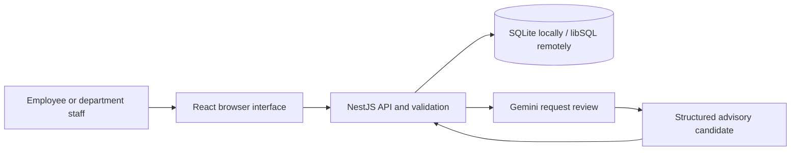

# Architecture

The product uses one React frontend and one NestJS backend. NestJS serves the compiled frontend at `/app/` and exposes the HTTP API on the same origin. Business rules live in backend services; the browser only presents the available actions.

The backend checks identity, department membership, field limits and legal state transitions. Prisma handles persistence. A request change and its history are committed together. Gemini receives only the draft and trusted department catalog; its answer is validated before use. It has no database tools and cannot change a request's status.

For the final hosting path, Render runs the application and Turso stores the database outside the application filesystem. Both are configured through environment variables. This avoids losing requests on a web-service restart. The remote path is configured but still needs deployment verification.

`/health` identifies the running release; `/health/ready` checks a database table. HTTP logs carry a request ID, route, status and duration without recording draft text or credentials. [Week 5](week5-release-operations.md) explains deployment, monitoring and recovery.

The demo employee selector is not a secure login. It lets a grader exercise roles, while server-side authorization is enforced for the selected identity. A real company deployment would need authenticated identities and additional abuse controls.
